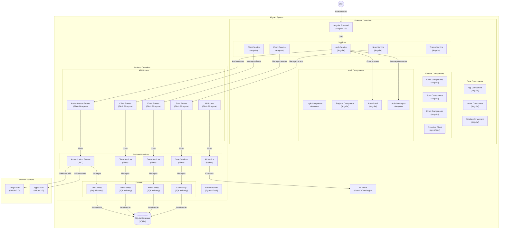

# AI model for preventing musculoskeletal injuries via posture analysis in real-time
The project aims to develop an AI model that can detect and prevent musculoskeletal injuries by analyzing the user's posture in real-time and comparing the user's flexibility with a few general movements such as squads, push-ups, etc. 

The model will be integrated into a medical portal desktop application that will provide feedback to the user on their posture and suggest corrective actions to prevent injuries through a PDF report after the scan. 

The project is currently under supervision of Pre. Nadia Tahiri, a professor at the University of Sherbrooke's computer science department, with the collaboration of the kinesiology clinic of the University of Sherbrooke.

> [!NOTE]
> The app is a work in progress at the moment. Instructions on installation will be available soon!

 
  
Small spoiler so far

    
    Oh, and we got dark mode too ;) 
    

## Table of contents (WIP)

### 1. Installation (WIP)
### 2. Architecture

